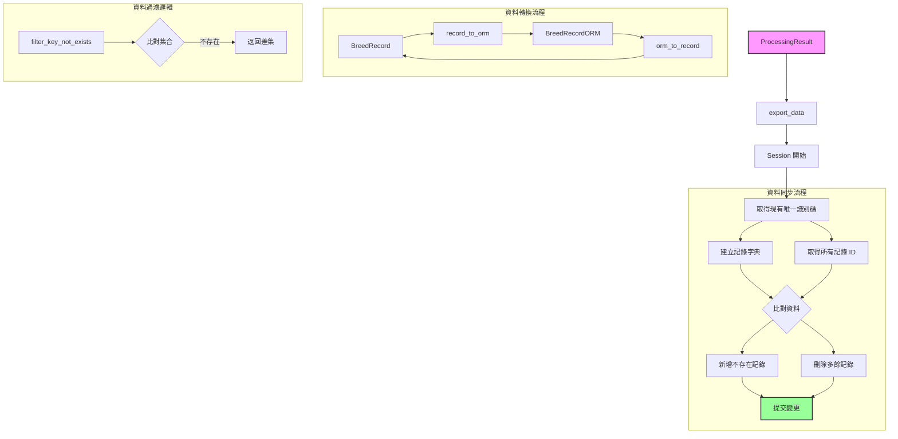

# BreedExporter 資料流程說明

本文件說明 `BreedSQLiteExporter` 類別的資料處理流程，包含資料同步、轉換和資料庫操作等主要功能。

## 資料流程圖



## 主要元件說明

### BreedRecordORM
- 資料表模型，對應資料庫中的入雛記錄表
- 使用 `SQLModel` 作為 ORM 基礎
- 欄位包含：
  - 基本資料（場名、地址、牌照）
  - 畜主資料（姓名、地址）
  - 批次資料（批次名稱、獸醫、品種等）
- 使用 `unique_id` 作為主鍵並建立索引

## 核心功能流程

### 1. 初始化流程
- 建立資料庫連線引擎
- 自動建立所需資料表結構
- 設定資料庫路徑和連線參數

### 2. 資料同步流程 (export_data)
1. **資料準備**
   - 開啟資料庫 Session
   - 取得現有記錄的唯一識別碼集合
   - 建立新資料的唯一識別碼集合和字典對照表

2. **同步操作**
   - 新增：儲存不存在於資料庫的記錄
   - 刪除：移除不存在於新資料中的舊記錄
   - 使用交易確保操作的原子性

### 3. 資料轉換流程
- **record_to_orm**：
  - 將 BreedRecord 轉換為 BreedRecordORM
  - 過濾空值欄位
  - 保留唯一識別碼
- **orm_to_record**：
  - 將 BreedRecordORM 轉換回 BreedRecord
  - 保持資料結構一致性

## 重要方法說明

### export_data
```python
def export_data(self, data: ProcessingResult[BreedRecord]) -> None:
```
- 主要的資料同步方法
- 使用 Session 進行交易管理
- 同時處理新增和刪除操作

### filter_key_not_exists
```python
def filter_key_not_exists(self, keys_to_compare: set[str], exist_keys: set[str]) -> set[str]:
```
- 計算兩個集合的差集
- 用於識別需要新增或刪除的記錄

### save_data / delete_data_by_key
- 處理單筆資料的新增和刪除
- 包含操作日誌輸出
- 自動處理資料轉換

## 資料安全性考量

1. **交易安全**
   - 使用 Session 確保交易完整性
   - 所有操作在提交前可回滾

2. **資料完整性**
   - 使用唯一識別碼防止重複
   - 自動處理空值欄位
   - 型別安全的資料轉換

3. **操作追蹤**
   - 記錄資料新增和刪除操作
   - 提供操作時間戳記

## 錯誤處理
- 資料庫連線異常處理
- 交易回滾機制
- 資料驗證和轉換異常處理
