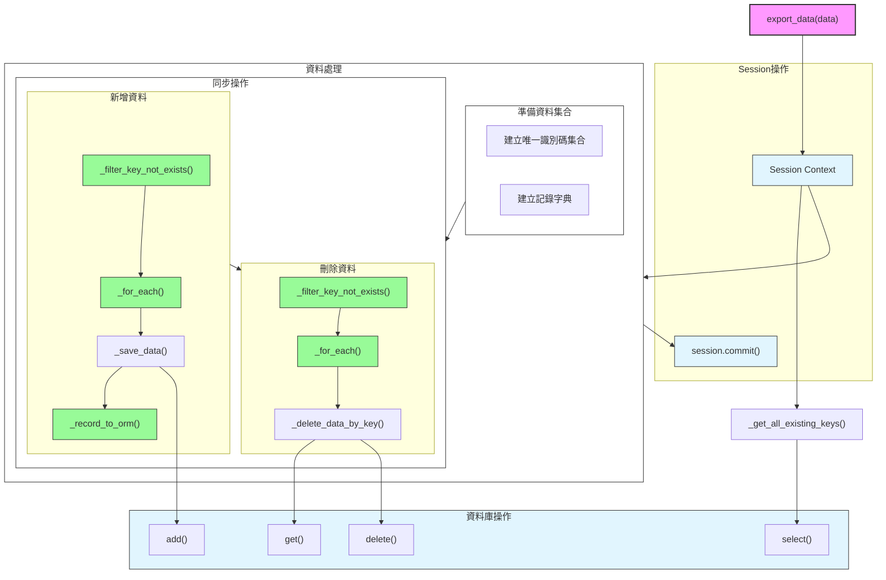
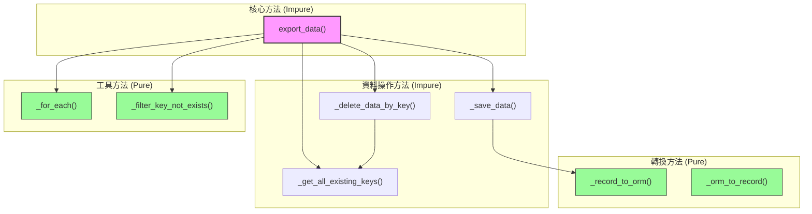

# BreedExporter 呼叫關係圖

## 方法呼叫圖

## 方法層級結構

## 主要方法說明

### 函數分類

#### 純函數 (Pure Functions)
具有以下特性的函數：
- 給定相同的輸入，永遠返回相同的輸出
- 不產生副作用（不修改外部狀態）
- 不依賴外部狀態

包含的方法：
- `_for_each`: 純粹的迭代操作
- `_filter_key_not_exists`: 純粹的集合運算
- `_record_to_orm`: 純粹的資料轉換
- `_orm_to_record`: 純粹的資料轉換

#### 非純函數 (Impure Functions)
具有以下特性的函數：
- 可能產生副作用（如資料庫操作、日誌記錄）
- 結果可能依賴外部狀態
- 相同輸入可能產生不同輸出

包含的方法：
- `export_data`: 執行資料庫操作
- `_save_data`: 修改資料庫狀態
- `_delete_data_by_key`: 修改資料庫狀態
- `_get_all_existing_keys`: 依賴資料庫狀態

### 核心方法
- `export_data`: 主要入口點，協調所有資料同步操作
  - 參數: `data: ProcessingResult[BreedRecord]`
  - 回傳: `None`
  - 類型: 非純函數（涉及資料庫操作）

### 資料操作方法
- `_save_data`: 儲存單筆記錄（非純函數）
- `_delete_data_by_key`: 刪除指定識別碼的記錄（非純函數）
- `_get_all_existing_keys`: 取得所有現有識別碼（非純函數）

### 工具方法
- `_for_each`: 通用迭代器（純函數）
- `_filter_key_not_exists`: 過濾不存在的識別碼（純函數）

### 轉換方法
- `_record_to_orm`: 資料模型轉換（純函數）
- `_orm_to_record`: 資料模型轉換（純函數）

## 呼叫關係特點

1. **單一職責**
   - 每個方法都有明確的功能
   - 轉換邏輯與資料操作分離

2. **層級結構**
   - 核心方法協調整體流程
   - 工具方法提供通用功能
   - 資料操作方法處理具體邏輯

3. **資料流向**
   - 資料同步雙向操作（新增/刪除）
   - 清晰的資料轉換路徑
   - 集中的交易管理

4. **純函數與非純函數分離**
   - 純函數負責資料轉換和工具操作
   - 非純函數處理資料庫操作和狀態管理
   - 清晰的職責分離有助於測試和維護