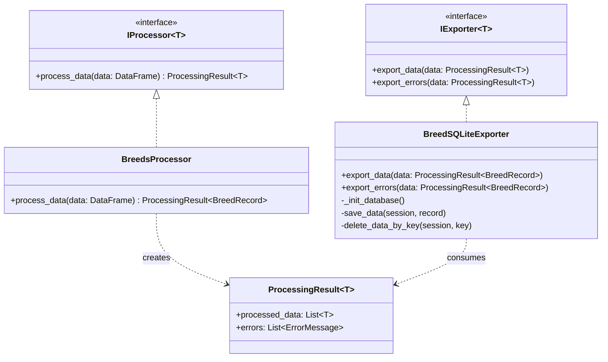
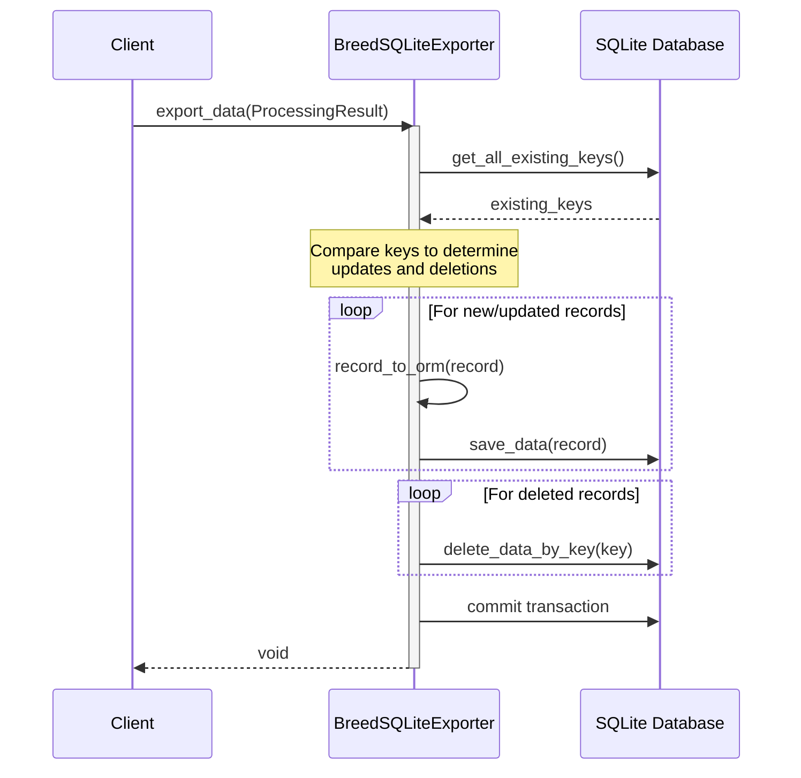
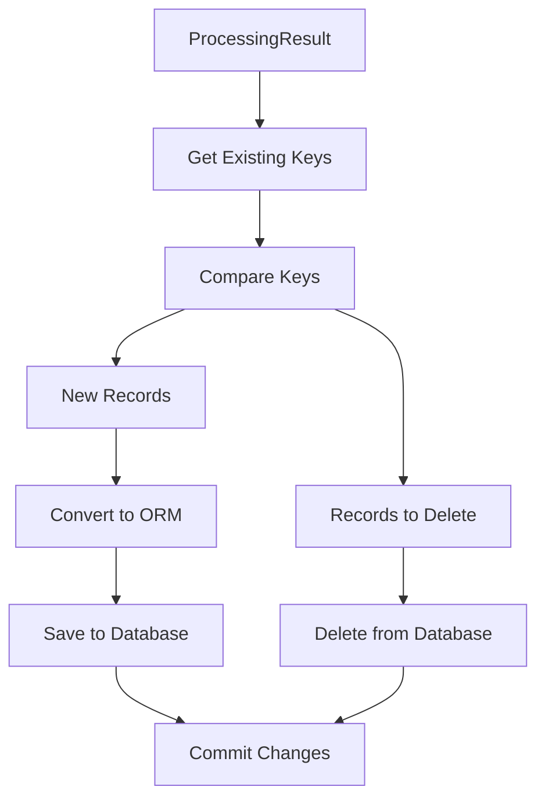

# 資料處理與匯出流程文件

## 1. 類別關係圖



## 2. 資料匯出時序圖



## 3. 資料匯出流程圖



## 4. 資料轉換與持久化

### BreedRecordORM 模型
```python
class BreedRecordORM(SQLModel, table=True):
    unique_id: str  # Primary Key
    farm_name: str | None
    # ... 其他欄位 ...
```

### 核心方法職責
1. **export_data**
   - 輸入：ProcessingResult<BreedRecord>
   - 處理：比對現有資料，執行新增/刪除操作
   - 輸出：void

2. **save_data**
   - 輸入：Session, BreedRecord
   - 處理：轉換並儲存記錄
   - 輸出：void

3. **delete_data_by_key**
   - 輸入：Session, str (unique_id)
   - 處理：刪除指定記錄
   - 輸出：void

## 5. 資料同步策略

1. **新增/更新策略**
   - 取得所有現有記錄的 unique_id
   - 比對新資料集的 unique_id
   - 對不存在的記錄執行新增操作

2. **刪除策略**
   - 找出資料庫中存在但新資料集中不存在的記錄
   - 執行刪除操作

3. **事務處理**
   - 使用 SQLAlchemy Session 確保事務完整性
   - 所有操作在同一事務中完成

## 使用範例

```python
# 建立匯出器實例
exporter = BreedSQLiteExporter("database.sqlite")

# 處理資料
processor = BreedsProcessor()
result = processor.process_data(df)

# 匯出資料
exporter.export_data(result)
