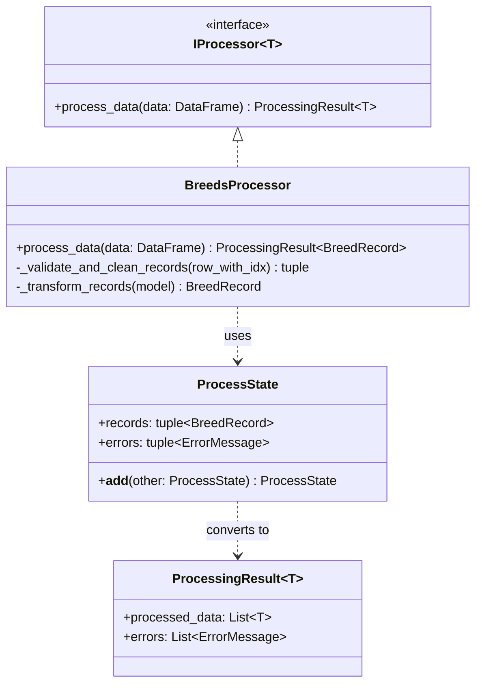
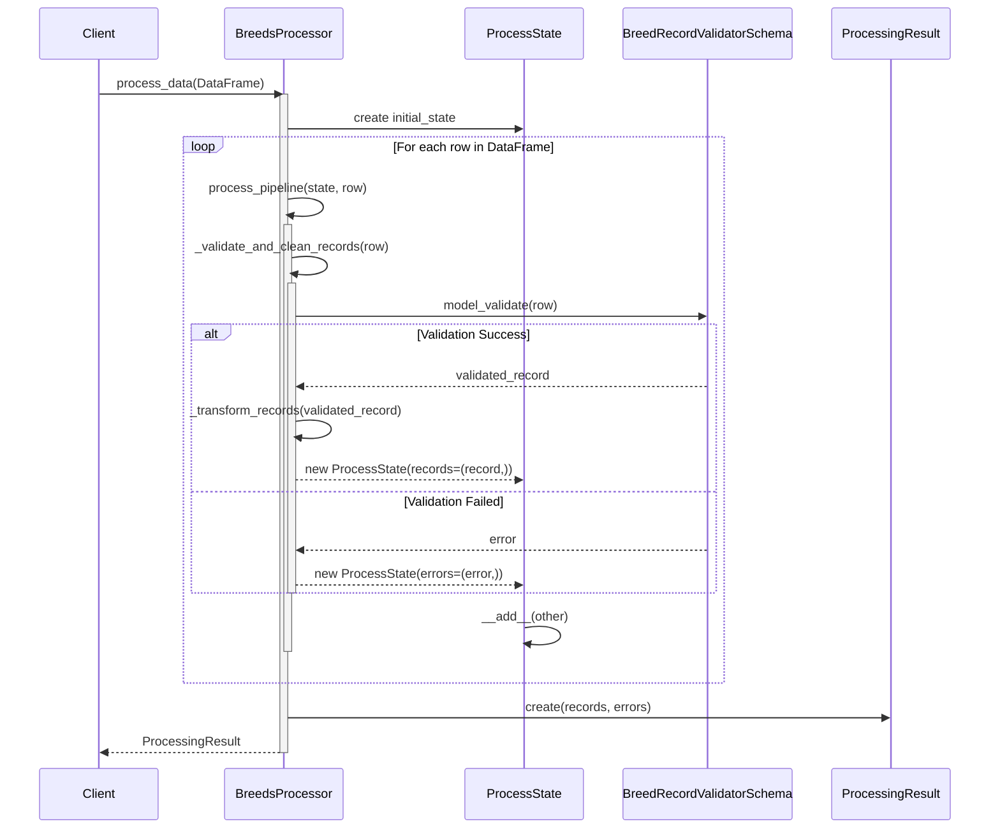
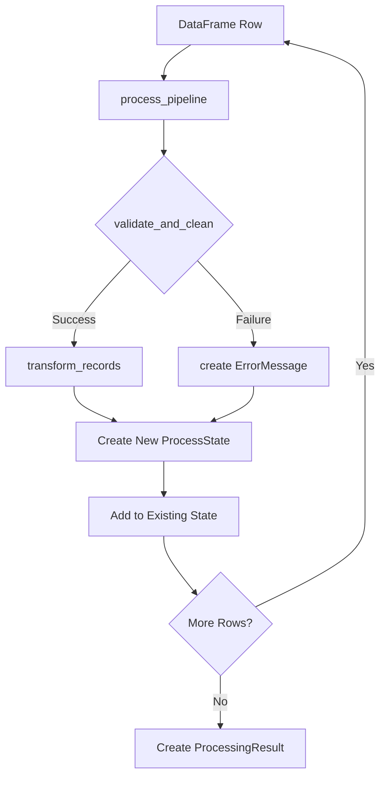
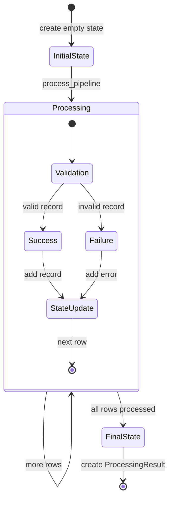
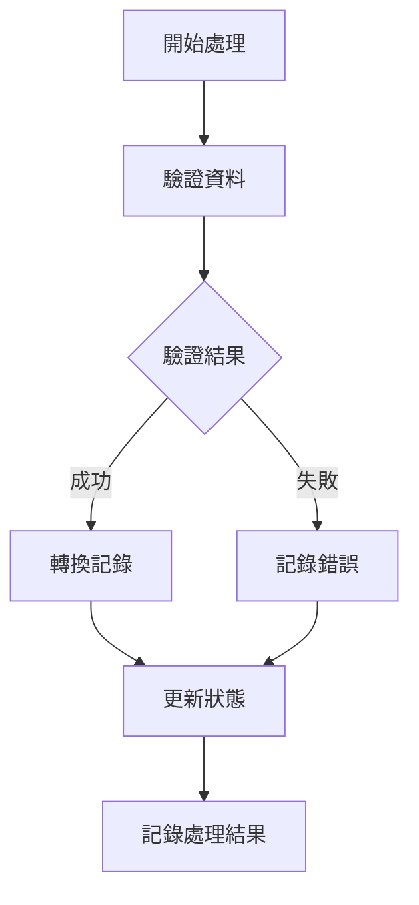

# BreedProcessor 資料流程文件

## 1. 類別關係圖



## 2. 資料處理時序圖



## 3. 資料轉換流程圖



## 4. ProcessState 狀態變化圖



## 5. 方法職責說明

### ProcessState
```python
@dataclass(frozen=True)
class ProcessState:
    records: tuple[BreedRecord, ...]  # 不可變的記錄集合
    errors: tuple[ErrorMessage, ...]  # 不可變的錯誤集合
    
    def __add__(self, other): # 實現狀態的不可變更新
```

### 核心方法流程
1. **process_data**
   - 輸入：DataFrame
   - 處理：使用 reduce 和 process_pipeline 處理每一行
   - 輸出：ProcessingResult

2. **process_pipeline**
   - 輸入：當前狀態和資料行
   - 處理：驗證、轉換、狀態更新
   - 輸出：新的 ProcessState

3. **_validate_and_clean_records**
   - 輸入：資料行
   - 處理：資料驗證
   - 輸出：(validated_record | None, error | None)

4. **_transform_records**
   - 輸入：驗證後的記錄
   - 處理：轉換為領域模型
   - 輸出：BreedRecord

## 6. 日誌記錄點



### 關鍵日誌
```python
logger.debug("處理結果: %s", len(final_state.records))
logger.debug("處理錯誤: %s", final_state.errors)
```

## 資料型別定義

```typescript
type DataContainer = [BreedRecord[], ErrorMessage[]]

interface BreedRecord {
    // 入雛記錄欄位...
}

interface ErrorMessage {
    message: string
    data: Record<string, any>
    extra: Record<string, any>
}

interface ProcessingResult<T> {
    processed_data: T[]
    errors: ErrorMessage[]
}
```

## 錯誤處理機制

1. **驗證錯誤**
   - 捕獲所有驗證異常
   - 轉換為 `ErrorMessage`
   - 保持處理流程繼續

2. **資料轉換錯誤**
   - 記錄詳細的錯誤資訊
   - 包含原始資料以供調試
   - 不中斷整體處理流程

## 使用範例

```python
# 建立處理器實例
processor = BreedsProcessor()

# 讀取 Excel 資料
df = pd.read_excel("breeds_data.xlsx")

# 處理資料
result = processor.process_data(df)

# 檢查結果
print(f"成功處理: {len(result.processed_data)} 筆")
print(f"錯誤數量: {len(result.errors)} 筆") 