# 《我在Cursor中花了400+小時，以下是我學到的》視覺解析

## 🔍 影片概述

這個視頻由David Ondrej分享，內容關於他在使用Cursor編輯器超過400小時後所獲得的經驗和技巧。Cursor是一款集成AI功能的程式編輯器，能夠幫助開發者更高效地編寫代碼。

---

## 📋 主要內容圖解

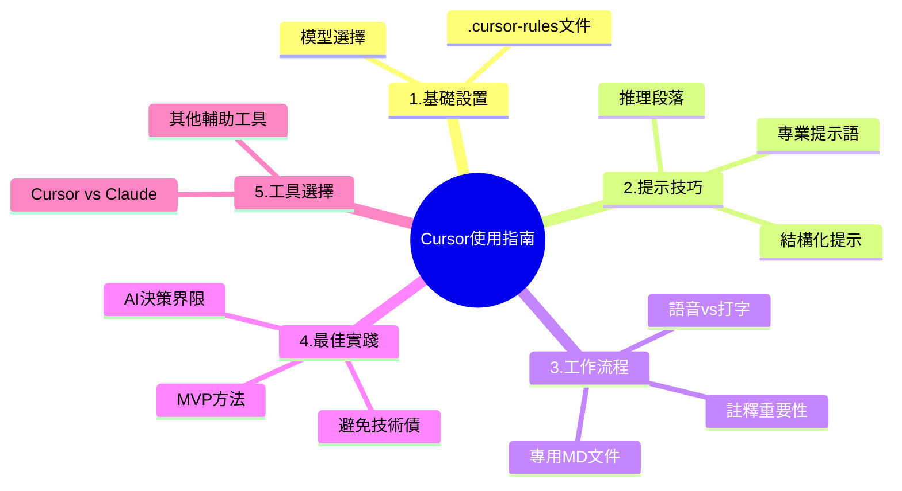

---

## 🛠️ 1. 基礎設置

### .cursor-rules文件設置

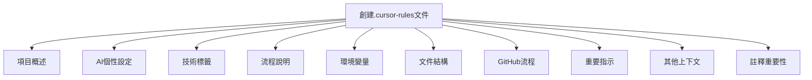

**文件內容要點：**
- 項目概述：描述項目願景
- AI個性設定：如「像高級開發者一樣教我」
- 技術標籤：前端、後端、數據庫等技術信息
- 流程說明：重複性指令集（如錯誤修復流程）
- 環境變量：在.env.ignore中的變量說明
- 文件結構：使用tree命令獲取
- GitHub流程：提交代碼的標準流程
- 重要指示：重複關鍵指令
- 其他上下文：額外相關信息
- 註釋重要性：強調代碼註釋的重要性

### 模型選擇

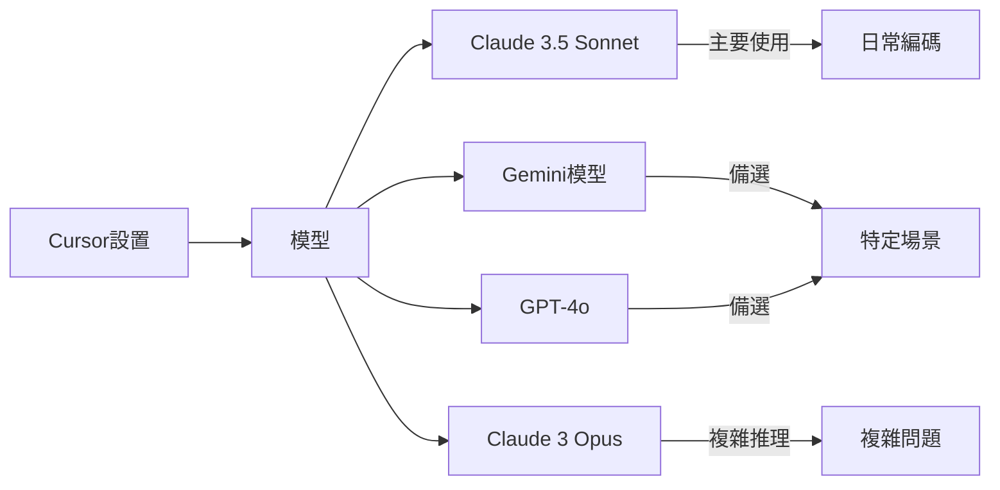

**推薦模型：**
- **Claude 3.5 Sonnet (1022版本)** - 主要使用 (99%)
- Gemini模型 - 備選
- GPT-4o - 備選
- Claude 3 Opus - 複雜推理

---

## 💡 2. 提示技巧

### 有效的提示語

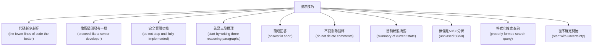

### 結構化提示模板

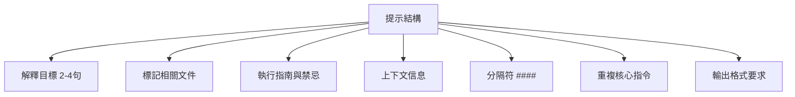

**提示結構說明：**
1. 簡短解釋你要做什麼（2-4句）
2. 標記相關文件（@file.js）
3. 執行指南與禁忌（如：只修改特定函數）
4. 上下文信息（如：文檔、API參考）
5. 分隔符（####）
6. 重複核心指令（最重要的部分）
7. 輸出格式要求（簡短回答、詳細註釋等）

---

## 📝 3. 工作流程

### 專用MD文件

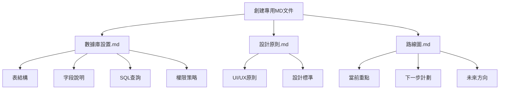

**專用MD文件用途：**
- 數據庫設置.md：包含表結構、字段、SQL查詢、權限策略
- 設計原則.md：UI/UX原則、設計標準
- 路線圖.md：當前重點、下一步計劃、未來方向

### 語音vs打字

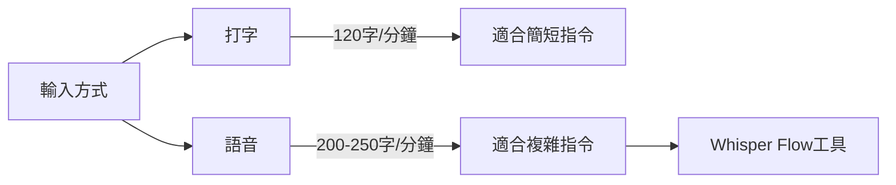

**語音輸入優勢：**
- 速度更快（200-250字/分鐘 vs 打字120字/分鐘）
- 適合複雜想法和指令
- 推薦工具：Whisper Flow（免費）

### 註釋重要性

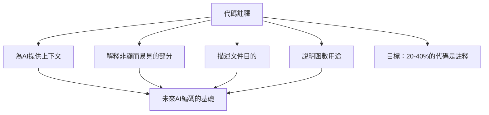

**註釋建議：**
- 每3-4行代碼寫1行註釋
- 解釋文件目的和函數用途
- 說明非顯而易見的邏輯
- 目標：代碼中20-40%是註釋
- 為未來的AI編碼提供基礎

---

## 🚀 4. 最佳實踐

### 避免技術債

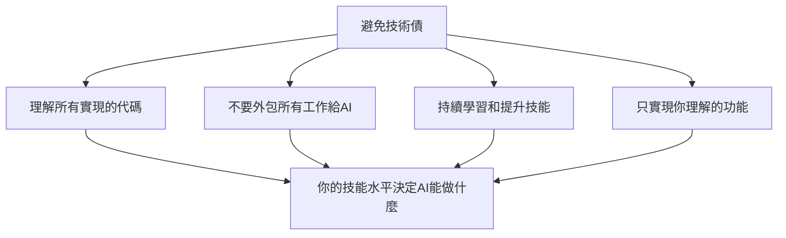

**避免技術債的關鍵：**
- 理解所有AI生成的代碼
- 不要完全依賴AI而不學習
- 持續提升自己的技能水平
- 你的技能水平決定了AI能幫你做到什麼程度

### MVP方法

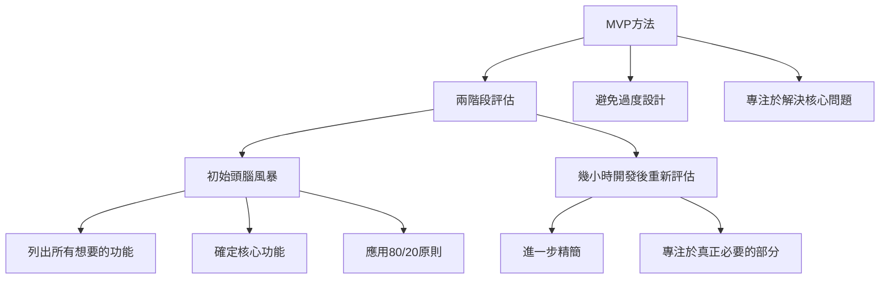

**MVP方法要點：**
- 初始頭腦風暴：列出所有想要的功能
- 確定真正的核心功能（80/20原則）
- 開發幾小時後重新評估
- 進一步精簡，只保留真正必要的部分
- 避免過度設計，專注於解決核心問題

### AI決策界限

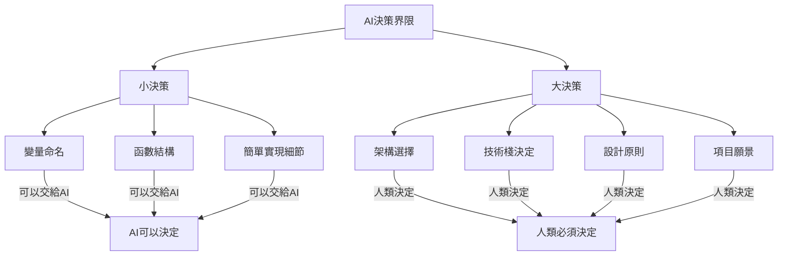

**決策分配：**
- AI可以決定：變量命名、函數結構、簡單實現細節
- 人類必須決定：架構選擇、技術棧、設計原則、項目願景

---

## 🔄 5. 工具選擇

### Cursor vs Claude

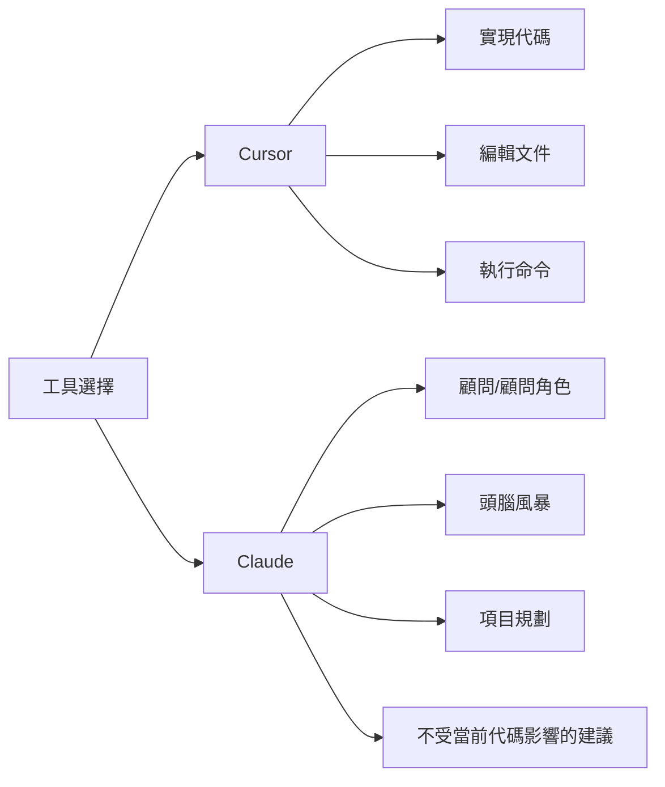

**工具選擇指南：**
- Cursor：作為程序員，實現代碼，編輯文件
- Claude：作為顧問，頭腦風暴，項目規劃

### 其他輔助工具

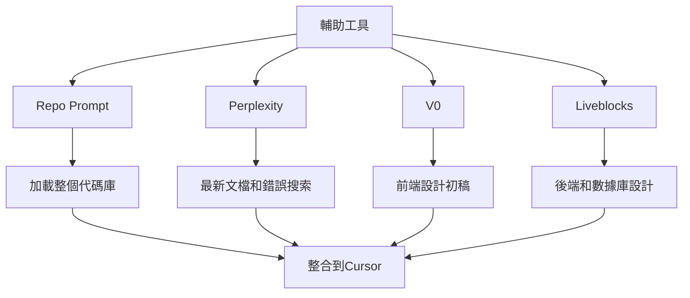

**輔助工具用途：**
- Repo Prompt：加載整個代碼庫到提示中
- Perplexity：獲取最新文檔和錯誤解決方案
- V0：前端設計初稿
- Liveblocks：後端和數據庫設計
- 最終都應整合到Cursor中開發

---

## 📊 總結

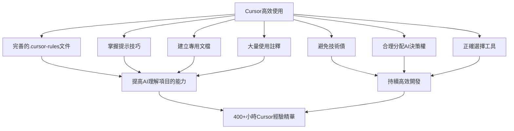

這份圖解總結了David Ondrej在使用Cursor 400+小時後分享的核心經驗和技巧，幫助開發者更高效地利用AI輔助編程工具進行開發。通過正確設置、有效提示、良好實踐和合理工具選擇，可以顯著提高開發效率和代碼質量。
