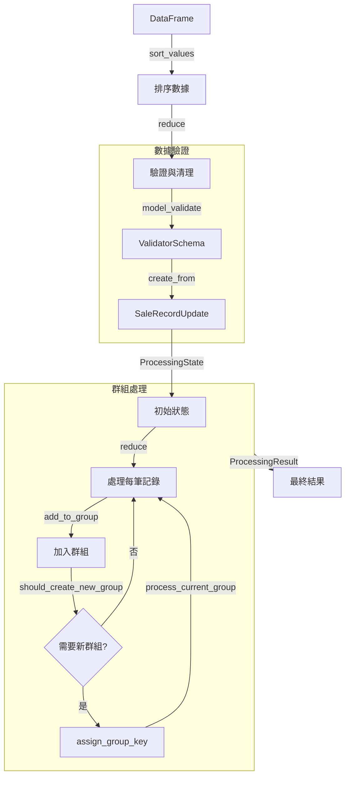
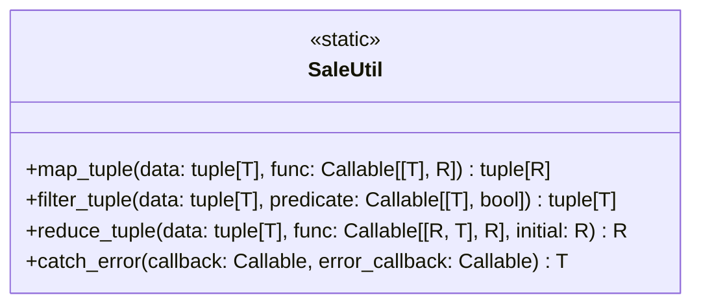
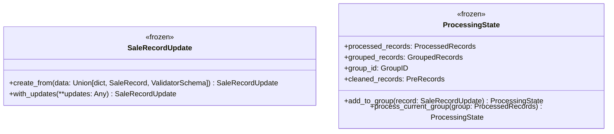
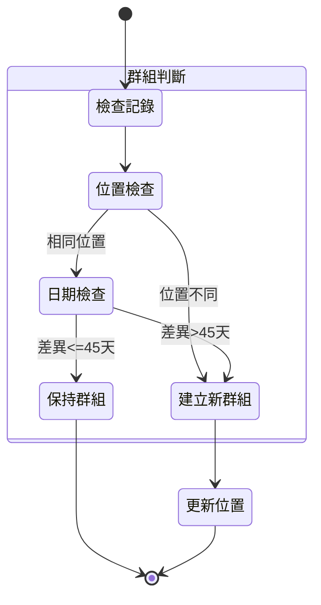
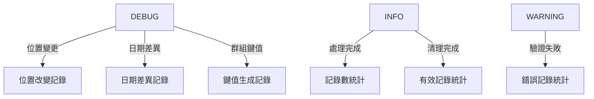

# SalesProcessor 資料流程分析

## 核心類型定義

```typescript
# 基礎類型
GroupID: TypeAlias = int
PreRecords: TypeAlias = tuple[SaleRecordUpdate, ...]
GroupedRecords: TypeAlias = tuple[SaleRecordUpdate, ...]
ProcessedRecords: TypeAlias = tuple[SaleRecordUpdate, ...]

# 泛型參數
T = TypeVar("T")  # 輸入類型
R = TypeVar("R")  # 返回類型
```

## 數據轉換流程



## 函數式工具集



## 不可變數據結構



## 群組處理邏輯



## 日誌層級



## 核心處理步驟

1. **數據驗證與清理**
   ```python
   def _validate_and_clean_records(data: pd.DataFrame) -> tuple[PreRecords, list[ErrorMessage]]:
       sorted_data = data.sort_values(by=["場別", "日期"])
       return reduce(process_row, sorted_data.iterrows(), ((), []))
   ```

2. **群組處理**
   ```python
   def _process_group_and_assign_keys(
       state: ProcessingState,
       record_with_idx: tuple[int, SaleRecordUpdate]
   ) -> ProcessingState:
       # 加入群組
       new_state = state.add_to_group(record)

       # 處理群組
       if should_process_group:
           processed_group = _assign_group_key_to_location(new_state.grouped_records)
           return new_state.process_current_group(processed_group)
   ```

3. **位置鍵值生成**
   ```python
   def _assign_group_key_to_location(group: tuple[SaleRecordUpdate, ...]) -> tuple[SaleRecordUpdate, ...]:
       median_date = _calculate_date_median(max_date, min_date)
       return SaleUtil.map_tuple(group, lambda r: r.with_updates(location=new_key))
   ```

## 不可變性保證

1. **資料結構**
   - 使用 `@dataclass(frozen=True)` 確保實例不可變
   - 所有集合使用 `tuple` 而非 `list`
   - 狀態更新通過 `replace` 創建新實例

2. **函數式操作**
   - 使用 `reduce` 進行狀態轉換
   - 通過 `map_tuple` 進行批量更新
   - 純函數設計，無副作用

3. **錯誤處理**
   - 使用 `catch_error` 包裝可能的異常
   - 錯誤信息通過 `ErrorMessage` 封裝
   - 日誌記錄錯誤但不影響流程
