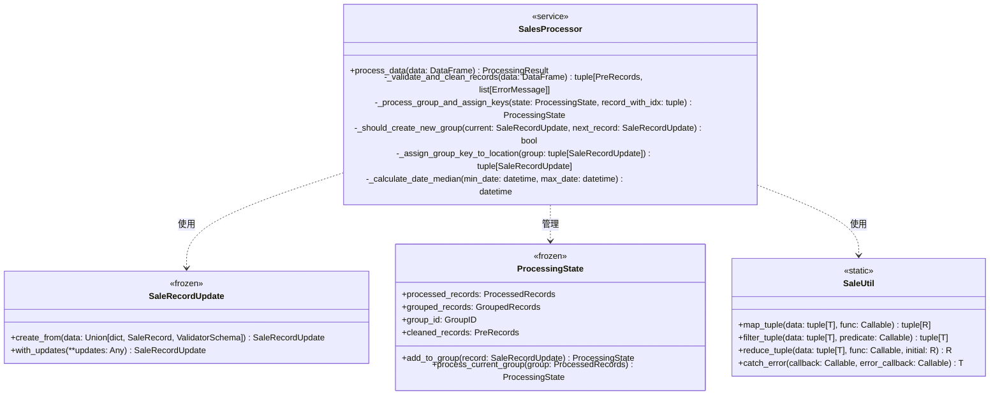

# SalesProcessor 方法分析

## 類型系統

```typescript
# 基礎類型別名
GroupID: TypeAlias = int
PreRecords: TypeAlias = tuple[SaleRecord, ...]
GroupedRecords: TypeAlias = tuple[SaleRecord, ...]
ProcessedRecords: TypeAlias = tuple[SaleRecord, ...]
SeriesRow: TypeAlias = pd.Series[Any]

# 泛型類型參數
T = TypeVar("T")  # 輸入類型
R = TypeVar("R")  # 返回類型
```

## 核心類別職責



## 方法調用序列


## 方法職責說明

### SalesProcessor 類

1. **process_data**
   - 輸入：`pd.DataFrame`
   - 輸出：`ProcessingResult[SaleRecord]`
   - 職責：協調整個處理流程
   - 步驟：
     1. 驗證和清理數據
     2. 初始化處理狀態
     3. 處理每筆記錄
     4. 返回最終結果

2. **_validate_and_clean_records**
   - 輸入：`pd.DataFrame`
   - 輸出：`tuple[PreRecords, list[ErrorMessage]]`
   - 職責：數據驗證和清理
   - 實現：
     ```python
     sorted_data = data.sort_values(by=["場別", "日期"])
     return reduce(process_row, sorted_data.iterrows(), ((), []))
     ```

3. **_process_group_and_assign_keys**
   - 輸入：`ProcessingState`, `tuple[int, SaleRecordUpdate]`
   - 輸出：`ProcessingState`
   - 職責：處理單筆記錄和群組
   - 關鍵邏輯：
     - 加入群組
     - 判斷是否需要處理群組
     - 處理群組並更新狀態

4. **_should_create_new_group**
   - 輸入：`SaleRecordUpdate`, `SaleRecordUpdate`
   - 輸出：`bool`
   - 職責：判斷是否需要創建新群組
   - 判斷條件：
     - 位置不同
     - 日期差異超過 45 天

5. **_assign_group_key_to_location**
   - 輸入：`tuple[SaleRecordUpdate, ...]`
   - 輸出：`tuple[SaleRecordUpdate, ...]`
   - 職責：生成群組位置鍵值
   - 實現：
     ```python
     median_date = _calculate_date_median(max_date, min_date)
     return SaleUtil.map_tuple(group, update_location)
     ```

### SaleRecordUpdate 類

1. **create_from**
   - 輸入：`dict | SaleRecord | SaleRecordValidatorSchema`
   - 輸出：`SaleRecordUpdate`
   - 職責：統一的記錄創建邏輯

2. **with_updates**
   - 輸入：`**updates: Any`
   - 輸出：`SaleRecordUpdate`
   - 職責：不可變的記錄更新

### ProcessingState 類

1. **add_to_group**
   - 輸入：`SaleRecordUpdate`
   - 輸出：`ProcessingState`
   - 職責：將記錄加入當前群組

2. **process_current_group**
   - 輸入：`ProcessedRecords`
   - 輸出：`ProcessingState`
   - 職責：處理當前群組並更新狀態

### SaleUtil 類

1. **map_tuple**
   - 輸入：`tuple[T]`, `Callable[[T], R]`
   - 輸出：`tuple[R]`
   - 職責：不可變的映射操作

2. **filter_tuple**
   - 輸入：`tuple[T]`, `Callable[[T], bool]`
   - 輸出：`tuple[T]`
   - 職責：不可變的過濾操作

3. **reduce_tuple**
   - 輸入：`tuple[T]`, `Callable[[R, T], R]`, `R`
   - 輸出：`R`
   - 職責：不可變的歸納操作

4. **catch_error**
   - 輸入：`Callable[[], T]`, `Callable[[Exception], T]`
   - 輸出：`T`
   - 職責：統一的錯誤處理

## 日誌記錄點

1. **INFO 級別**
   - 處理完成統計
   - 資料清理結果

2. **WARNING 級別**
   - 資料驗證失敗

3. **DEBUG 級別**
   - 位置變更追蹤
   - 日期差異檢查
   - 鍵值生成過程 