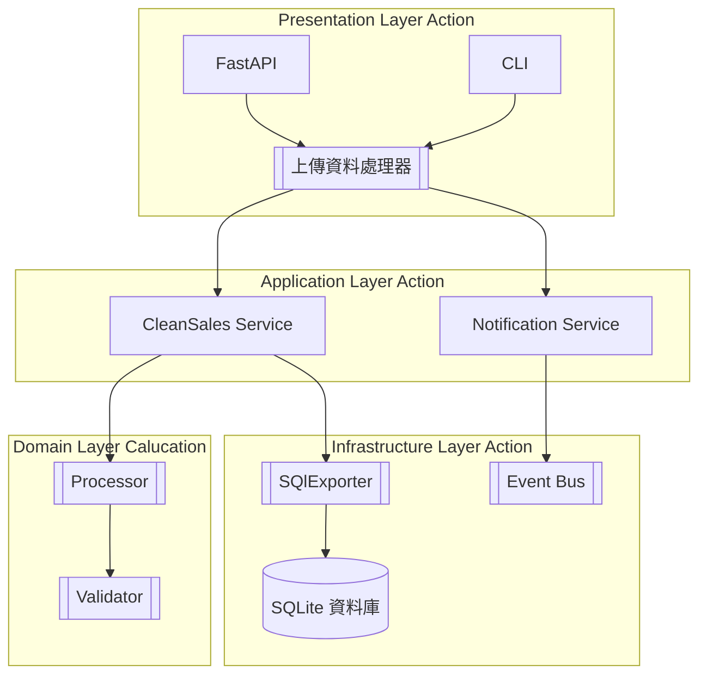
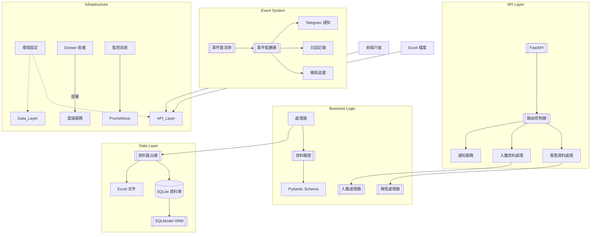
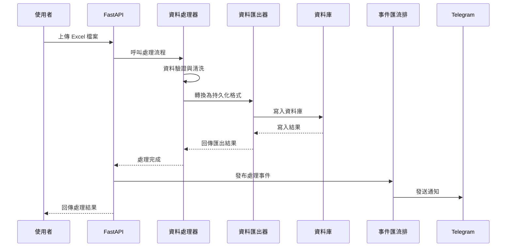
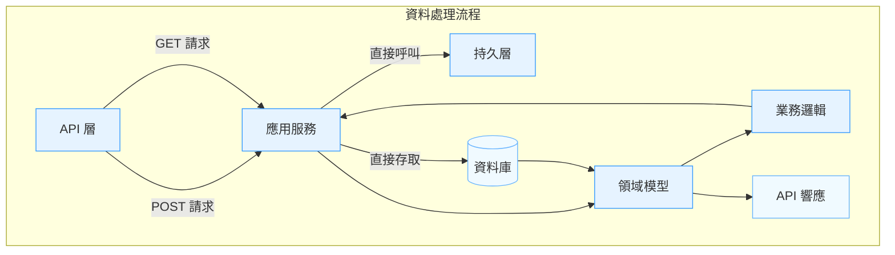
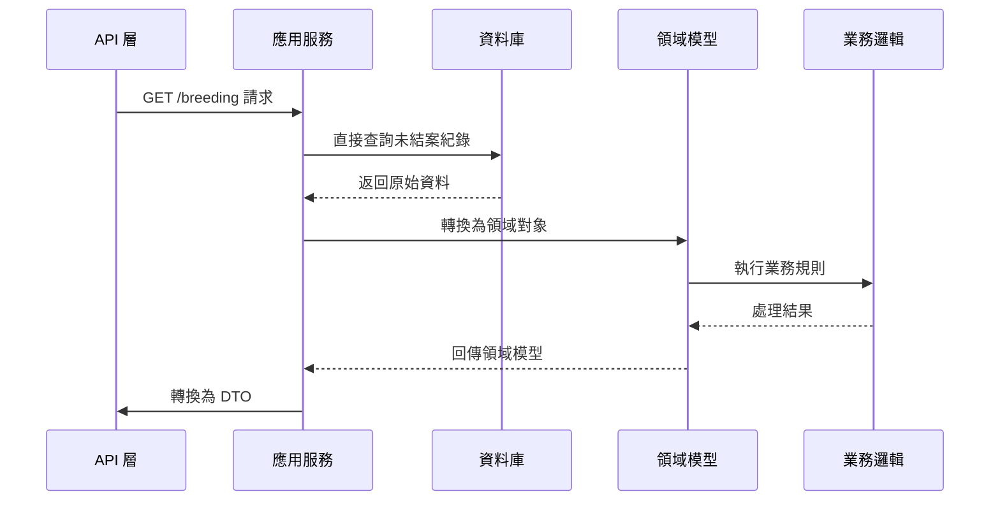
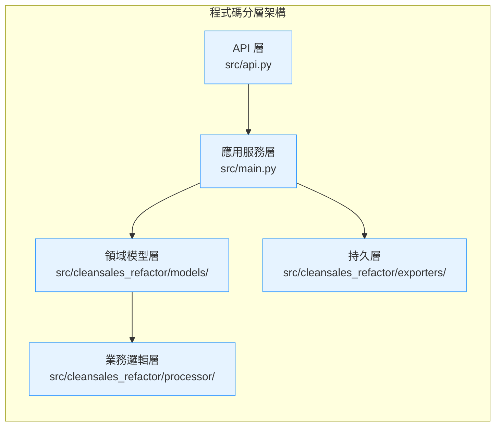
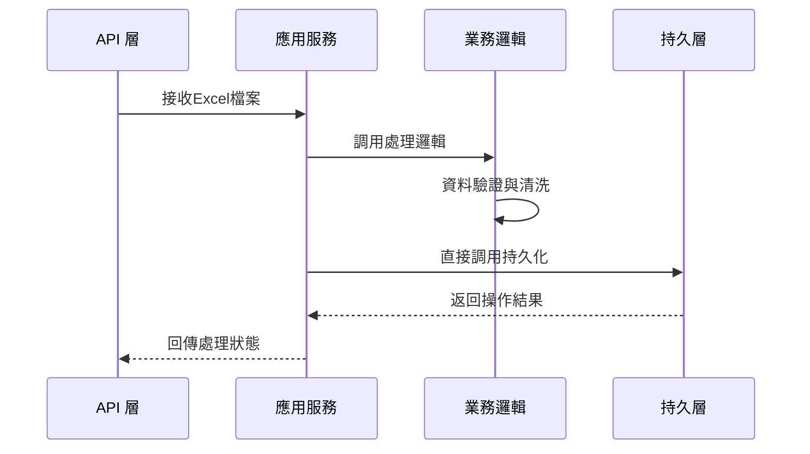
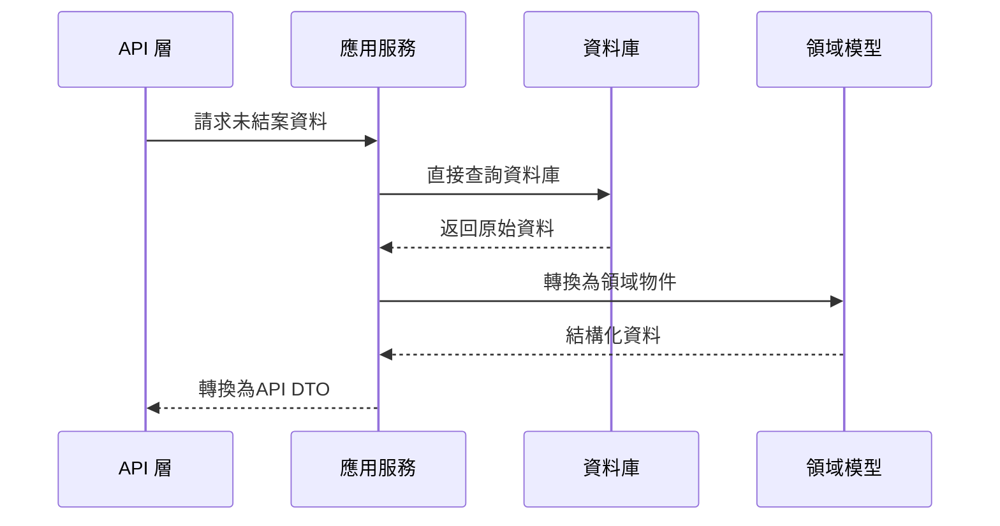

# CleanSales 系統架構說明

## 技術架構圖(api.post)


## 技術架構圖


## 分層架構說明

1. **接入層 (API Layer)**
   - 對應檔案: `src/api.py`
   - 職責:
     - 接收 HTTP 請求並路由到對應服務
     - 處理請求參數驗證與格式轉換
     - 返回標準化 API 響應
   - 關鍵特性:
     - 完全獨立於業務邏輯實現
     - 僅依賴應用服務層接口
     - 使用 FastAPI 的 dependency injection 管理服務實例

2. **應用服務層 (Application Service Layer)**
   - 對應檔案: `src/services/`
   - 職責:
     - 協調跨領域對象的工作流程
     - 處理事務邊界與錯誤處理
     - 轉換領域對象與 DTO
   - 關鍵特性:
     - 封裝核心業務流程
     - 調用領域層與基礎設施層
     - 完全獨立於框架實現

3. **領域模型層 (Domain Layer)**
   - 對應目錄: `src/cleansales_refactor/models/`
   - 職責:
     - 定義核心業務模型與規則
     - 實現領域驅動設計模式
     - 封裝業務狀態變更邏輯
   - 關鍵特性:
     - 純業務邏輯實現
     - 零依賴外部框架
     - 通過值對象保護業務不變量

4. **基礎設施層 (Infrastructure Layer)**
   - 雙模態儲存支援:
     - SQLite:交易型資料儲存
     - Excel:原始資料歸檔
   - ORM 架構:
     - 使用 SQLModel 整合 SQLAlchemy 與 Pydantic
     - 自動化資料庫遷移
   - 資料匯出器模式:
     - 抽象化 exporter 介面
     - 支援擴充其他儲存後端

4. **事件系統 (Event System)**
   - 觀察者模式實作:
     - 核心事件總線 (EventBus)
     - 事件驅動通知系統
   - 通知管道:
     - Telegram 即時通知
     - 日誌記錄 (Logging)
     - 稽核追蹤 (Audit Trail)

5. **基礎設施 (Infrastructure)**
   - 環境設定:
     - 12-factor 應用設計
     - 環境變數管理
   - 容器化部署:
     - Docker 容器封裝
     - 支援雲端服務部署
   - 監控系統:
     - Prometheus 指標收集
     - 健康檢查端點

## 核心模組互動流程


## 分層架構與資料流設計



### 核心分層職責調整

1. **應用服務層 (Application Service Layer)**
```python
# src/main.py 中的 DataService 範例
class DataService:
    def sales_data_service(self, file_path: Path) -> dict:
        # 協調領域層與持久層
        source_data = self._prepare_source_data(file_path)
        processed = SalesProcessor.execute(source_data)  # 業務邏輯
        result = self.sales_exporter.execute(processed)  # 持久化操作
        return result
```

2. **持久層 (Persistence Layer)**
```python
# src/cleansales_refactor/exporters/sales_exporter.py
class SaleSQLiteExporter:
    def execute(self, session: Session, processed_data: ProcessingResult) -> dict:
        """直接由應用服務層呼叫"""
        # 資料庫操作
        self._save_to_db(session, processed_data.validated)
        # 回傳純資料結構
        return {
            "added": len(processed_data.validated),
            "deleted": len(processed_data.removed)
        }
```

3. **領域驅動查詢流程**


### 分層邊界規範
1. **POST 請求流程**
   - API 層接收請求後委派給應用服務
   - 應用服務協調領域模型與業務邏輯
   - 持久化操作直接由應用服務調用
   - 業務邏輯層完全無狀態

2. **GET 請求流程**
   - 應用服務直接存取資料庫獲取原始資料
   - 原始資料轉換為領域模型進行業務處理
   - 最終轉換為 DTO 結構返回
   - 資料庫 schema 與領域模型解耦

3. **層間通訊規則**
   - 上層可依賴下層,反之禁止
   - 跨層呼叫需通過接口抽象
   - 領域模型不感知持久化細節
   - DTO 轉換僅在應用服務層進行
# CleanSales 系統架構說明

## 技術架構圖


## 分層架構說明

1. **接入層 (API Layer)**
   - FastAPI 框架提供 RESTful 介面
   - 主要端點:
     - POST /process-sales:處理銷售資料
     - POST /process-breeds:處理入雛資料
     - GET /breeding:取得未結案養殖資料
   - 支援跨域請求 (CORS)
   - 靜態檔案服務

2. **業務邏輯層 (Business Logic)**
   - 雙重處理器設計:
     - SalesProcessor:銷售資料正規化與計算
     - BreedsProcessor:養殖批次資料分析
   - 資料驗證機制:
     - 基於 Pydantic 的嚴格 schema 驗證
     - 支援 Excel 檔案格式檢查
     - MD5 校驗防止重複處理

3. **資料持久層 (Data Layer)**
   - 雙模態儲存支援:
     - SQLite:交易型資料儲存
     - Excel:原始資料歸檔
   - ORM 架構:
     - 使用 SQLModel 整合 SQLAlchemy 與 Pydantic
     - 自動化資料庫遷移
   - 資料匯出器模式:
     - 抽象化 exporter 介面
     - 支援擴充其他儲存後端

4. **事件系統 (Event System)**
   - 觀察者模式實作:
     - 核心事件總線 (EventBus)
     - 事件驅動通知系統
   - 通知管道:
     - Telegram 即時通知
     - 日誌記錄 (Logging)
     - 稽核追蹤 (Audit Trail)

5. **基礎設施 (Infrastructure)**
   - 環境設定:
     - 12-factor 應用設計
     - 環境變數管理
   - 容器化部署:
     - Docker 容器封裝
     - 支援雲端服務部署
   - 監控系統:
     - Prometheus 指標收集
     - 健康檢查端點

## 核心模組互動流程


## 分層架構規範



### 分層職責與檔案對應

| 架構層級            | 主要職責                              | 對應檔案/目錄                          | 重要類別/元件                     |
|---------------------|---------------------------------------|----------------------------------------|----------------------------------|
| **API 層**          | 接收HTTP請求/回應,路由管理           | `src/api.py`                           | FastAPI app, 路由端點           |
| **應用服務層**       | 協調跨層操作,工作流程管理            | `src/main.py`                          | DataService, 服務入口點         |
| **領域模型層**       | 定義核心業務模型與驗證規則            | `src/cleansales_refactor/models/`      | BreedRecord, SaleRecord         |
| **業務邏輯層**       | 實現核心業務處理邏輯                  | `src/cleansales_refactor/processor/`   | SalesProcessor, BreedsProcessor |
| **持久層**           | 資料存取與持久化操作                  | `src/cleansales_refactor/exporters/`   | SaleSQLiteExporter, Database    |

### 層間通訊規範

1. **POST 請求流程**


2. **GET 請求流程**


### 分層邊界規則
1. 嚴格單向依賴:APILayer → AppLayer → {DomainLayer, PersistenceLayer}
2. 業務邏輯層僅依賴領域模型層
3. 持久層不包含業務規則,僅處理資料存取
4. 領域模型保持純粹,不依賴任何基礎設施
# CleanSales 系統架構說明

## 技術架構圖


## 分層架構說明

1. **接入層 (API Layer)**
   - FastAPI 框架提供 RESTful 介面
   - 主要端點:
     - POST /process-sales:處理銷售資料
     - POST /process-breeds:處理入雛資料
     - GET /breeding:取得未結案養殖資料
   - 支援跨域請求 (CORS)
   - 靜態檔案服務

2. **業務邏輯層 (Business Logic)**
   - 雙重處理器設計:
     - SalesProcessor:銷售資料正規化與計算
     - BreedsProcessor:養殖批次資料分析
   - 資料驗證機制:
     - 基於 Pydantic 的嚴格 schema 驗證
     - 支援 Excel 檔案格式檢查
     - MD5 校驗防止重複處理

3. **資料持久層 (Data Layer)**
   - 雙模態儲存支援:
     - SQLite:交易型資料儲存
     - Excel:原始資料歸檔
   - ORM 架構:
     - 使用 SQLModel 整合 SQLAlchemy 與 Pydantic
     - 自動化資料庫遷移
   - 資料匯出器模式:
     - 抽象化 exporter 介面
     - 支援擴充其他儲存後端

4. **事件系統 (Event System)**
   - 觀察者模式實作:
     - 核心事件總線 (EventBus)
     - 事件驅動通知系統
   - 通知管道:
     - Telegram 即時通知
     - 日誌記錄 (Logging)
     - 稽核追蹤 (Audit Trail)

5. **基礎設施 (Infrastructure)**
   - 環境設定:
     - 12-factor 應用設計
     - 環境變數管理
   - 容器化部署:
     - Docker 容器封裝
     - 支援雲端服務部署
   - 監控系統:
     - Prometheus 指標收集
     - 健康檢查端點

## 核心模組互動流程


## 分層架構與資料流設計


### 核心分層職責調整

1. **應用服務層 (Application Service Layer)**
```python
# src/main.py 中的 DataService 範例
class DataService:
    def sales_data_service(self, file_path: Path) -> dict:
        # 協調領域層與持久層
        source_data = self._prepare_source_data(file_path)
        processed = SalesProcessor.execute(source_data)  # 業務邏輯
        result = self.sales_exporter.execute(processed)  # 持久化操作
        return result
```

2. **持久層 (Persistence Layer)**
```python
# src/cleansales_refactor/exporters/sales_exporter.py
class SaleSQLiteExporter:
    def execute(self, session: Session, processed_data: ProcessingResult) -> dict:
        """直接由應用服務層呼叫"""
        # 資料庫操作
        self._save_to_db(session, processed_data.validated)
        # 回傳純資料結構
        return {
            "added": len(processed_data.validated),
            "deleted": len(processed_data.removed)
        }
```

3. **領域驅動查詢流程**


### 分層邊界規範
1. **POST 請求流程**
   - API 層接收請求後委派給應用服務
   - 應用服務協調領域模型與業務邏輯
   - 持久化操作直接由應用服務調用
   - 業務邏輯層完全無狀態

2. **GET 請求流程**
   - 應用服務直接存取資料庫獲取原始資料
   - 原始資料轉換為領域模型進行業務處理
   - 最終轉換為 DTO 結構返回
   - 資料庫 schema 與領域模型解耦

3. **層間通訊規則**
   - 上層可依賴下層,反之禁止
   - 跨層呼叫需通過接口抽象
   - 領域模型不感知持久化細節
   - DTO 轉換僅在應用服務層進行
# CleanSales 系統架構說明

## 技術架構圖


## 分層架構說明

1. **接入層 (API Layer)**
   - FastAPI 框架提供 RESTful 介面
   - 主要端點:
     - POST /process-sales:處理銷售資料
     - POST /process-breeds:處理入雛資料
     - GET /breeding:取得未結案養殖資料
   - 支援跨域請求 (CORS)
   - 靜態檔案服務

2. **業務邏輯層 (Business Logic)**
   - 雙重處理器設計:
     - SalesProcessor:銷售資料正規化與計算
     - BreedsProcessor:養殖批次資料分析
   - 資料驗證機制:
     - 基於 Pydantic 的嚴格 schema 驗證
     - 支援 Excel 檔案格式檢查
     - MD5 校驗防止重複處理

3. **資料持久層 (Data Layer)**
   - 雙模態儲存支援:
     - SQLite:交易型資料儲存
     - Excel:原始資料歸檔
   - ORM 架構:
     - 使用 SQLModel 整合 SQLAlchemy 與 Pydantic
     - 自動化資料庫遷移
   - 資料匯出器模式:
     - 抽象化 exporter 介面
     - 支援擴充其他儲存後端

4. **事件系統 (Event System)**
   - 觀察者模式實作:
     - 核心事件總線 (EventBus)
     - 事件驅動通知系統
   - 通知管道:
     - Telegram 即時通知
     - 日誌記錄 (Logging)
     - 稽核追蹤 (Audit Trail)

5. **基礎設施 (Infrastructure)**
   - 環境設定:
     - 12-factor 應用設計
     - 環境變數管理
   - 容器化部署:
     - Docker 容器封裝
     - 支援雲端服務部署
   - 監控系統:
     - Prometheus 指標收集
     - 健康檢查端點

## 核心模組互動流程


## 目錄結構設計原則
1. **模組化分割**:依功能切分 exporters/processors/models
2. **分層隔離**:API層與業務邏輯層完全解耦
3. **可測試性**:獨立 tests/ 目錄包含單元測試
4. **配置分離**:環境設定集中管理
5. **文件導向**:docs/ 目錄包含架構與流程說明
```mermaid
classDiagram
    class FastAPI {
        <<FastAPI>>
        +app: FastAPI
        +add_middleware()
        +mount()
        +get()
        +post()
    }

    class EventBus {
        +publish(event: Event)
        +register(event: Enum, callback: Callable)
    }

    class TelegramNotifier {
        +notify(event: Event)
    }

    class PostApiDependency {
        +sales_processpipline()
        +breed_processpipline()
        +process_breed_records()
        +get_breeds_is_not_completed()
    }

    class DataService {
        +sales_data_service()
        +breeds_data_service()
    }

    class Database {
        +get_session()
    }

    class SaleSQLiteExporter {
        +execute()
        +is_source_md5_exists_in_latest_record()
    }

    class BreedSQLiteExporter {
        +execute()
        +is_source_md5_exists_in_latest_record()
    }

    class SalesProcessor {
        +execute()
    }

    class BreedsProcessor {
        +execute()
    }

    FastAPI --> PostApiDependency : depends on
    PostApiDependency --> EventBus : depends on
    PostApiDependency --> SaleSQLiteExporter : depends on
    PostApiDependency --> BreedSQLiteExporter : depends on
    EventBus --> TelegramNotifier : notifies
    DataService --> Database : depends on
    DataService --> SaleSQLiteExporter : depends on
    DataService --> BreedSQLiteExporter : depends on
    SaleSQLiteExporter --> SalesProcessor : processes
    BreedSQLiteExporter --> BreedsProcessor : processes
    ```
