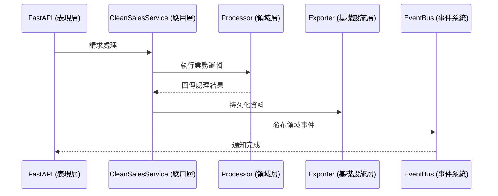
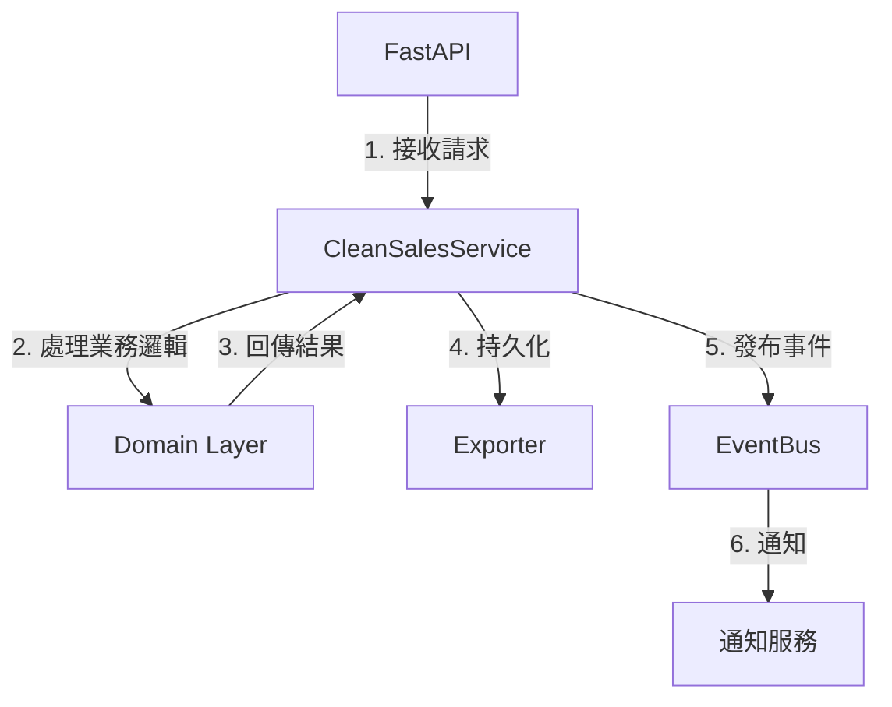
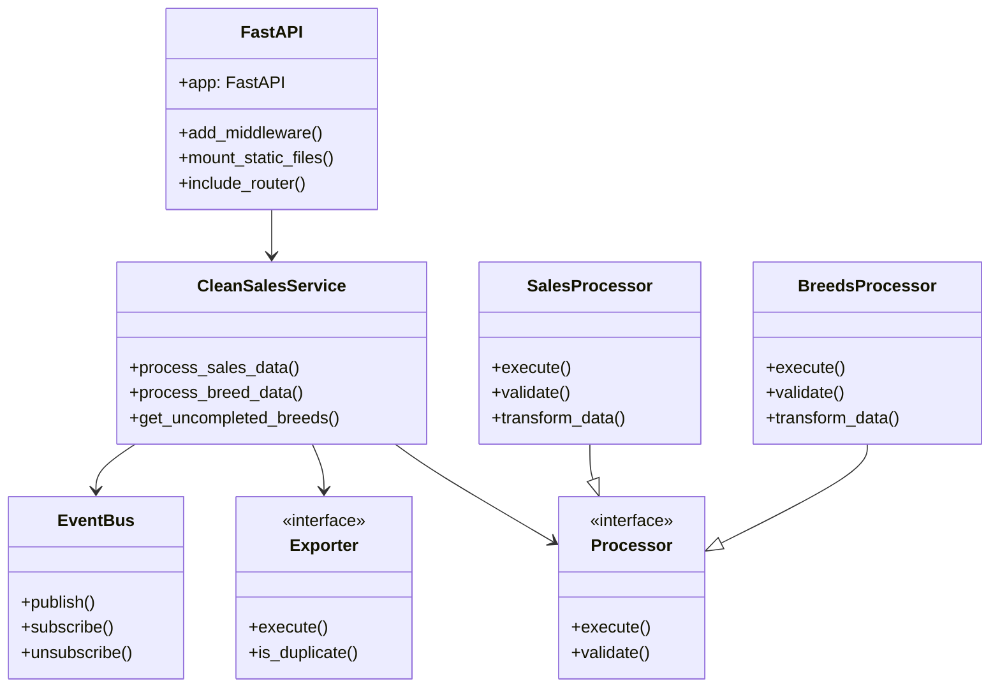
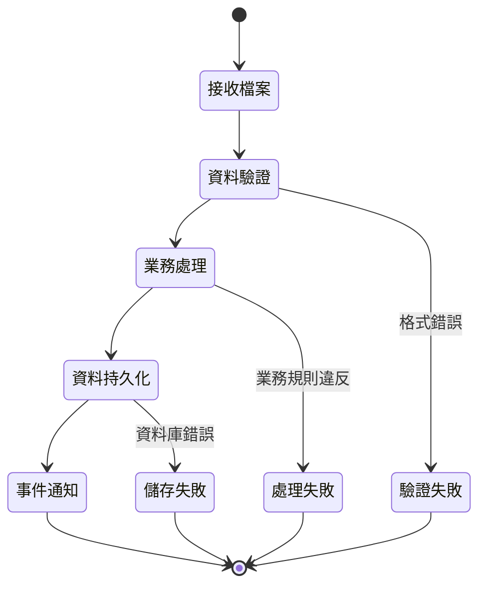
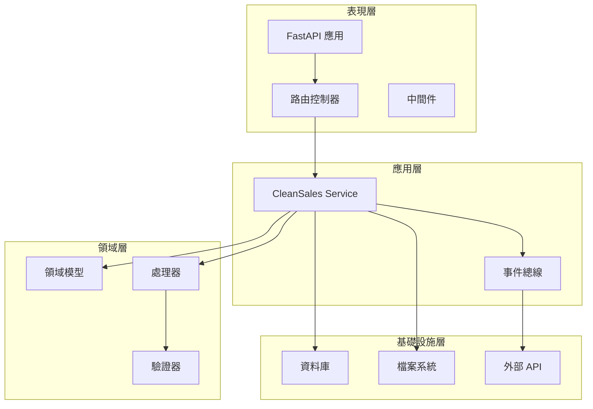
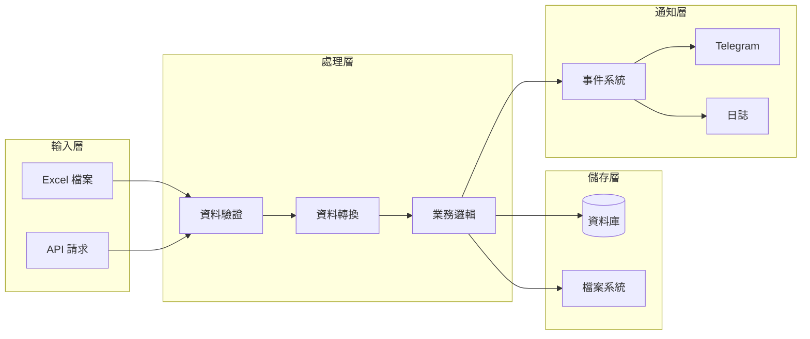
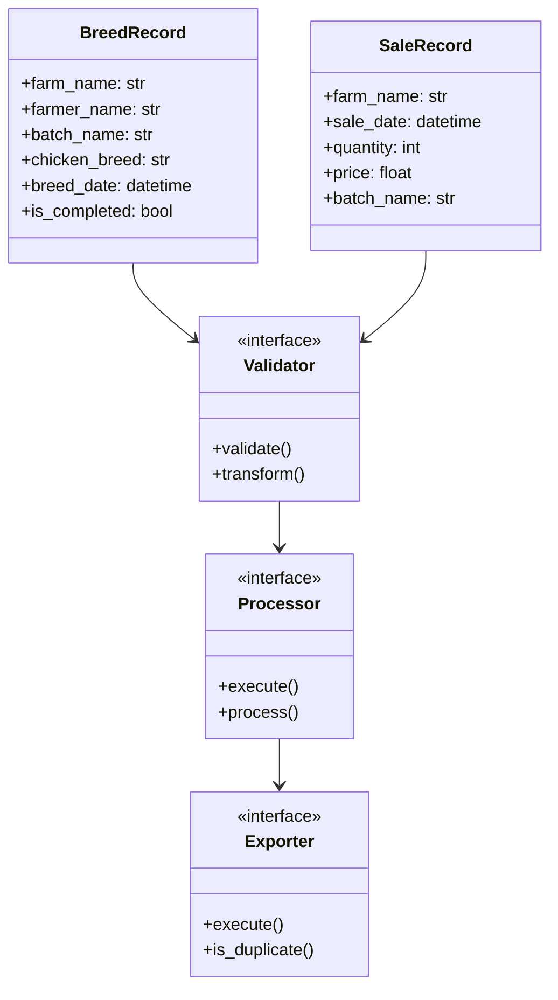

# CleanSales 系統架構說明

## 目錄結構
```
src/
├── cleansales_refactor/     # 核心業務邏輯
│   ├── domain/             # 領域模型
│   ├── processors/         # 業務處理器
│   ├── exporters/          # 資料持久化
│   ├── shared/             # 共用元件
│   └── cleansales_service.py # 應用服務層
├── fastapi/                # API 層
├── main.py                 # 應用程式入口
├── api.py                  # API 路由定義
└── event_bus.py           # 事件系統
```

## 分層架構說明

1. **領域層 (Domain Layer)**
   - 位置: `src/cleansales_refactor/domain/`
   - 職責:
     - 定義核心業務模型
     - 實作領域邏輯與規則
     - 維護業務不變量

2. **應用服務層 (Application Layer)**
   - 位置: `src/cleansales_refactor/cleansales_service.py`
   - 職責:
     - 協調領域物件與基礎設施
     - 處理交易邊界
     - 實作使用案例流程

3. **基礎設施層 (Infrastructure Layer)**
   - 位置: `src/cleansales_refactor/exporters/`
   - 職責:
     - 實作資料持久化
     - 提供外部系統整合
     - 處理技術細節

4. **表現層 (Presentation Layer)**
   - 位置: `src/fastapi/`
   - 職責:
     - 提供 API 端點
     - 處理 HTTP 請求/回應
     - 實作路由邏輯

5. **共用核心 (Shared Kernel)**
   - 位置: `src/cleansales_refactor/shared/`
   - 職責:
     - 提供共用工具類別
     - 定義跨層級介面
     - 實作通用功能

## 核心元件互動


## 分層職責與依賴規則

1. 表現層 (`fastapi/`)
   - 依賴於應用服務層
   - 不直接存取領域層
   - 處理 HTTP 相關邏輯

2. 應用服務層 (`cleansales_service.py`)
   - 協調領域物件與基礎設施
   - 實作使用案例流程
   - 管理交易邊界

3. 領域層 (`domain/`)
   - 純粹的業務邏輯
   - 不依賴外部系統
   - 維護業務規則

4. 基礎設施層 (`exporters/`)
   - 實作持久化邏輯
   - 提供外部系統整合
   - 依賴於領域層介面

## 事件系統設計

1. 核心元件
   - EventBus: 事件發布與訂閱
   - 領域事件: 業務狀態變更通知
   - 事件處理器: 特定事件的處理邏輯

2. 主要功能
   - 非同步處理
   - 系統整合
   - 領域事件追蹤

## 資料流程


## 設計原則

1. **領域驅動設計 (DDD)**
   - 以領域模型為核心
   - 明確的限界上下文
   - 豐富的領域物件

2. **依賴反轉原則 (DIP)**
   - 高層模組不依賴低層模組
   - 抽象不依賴細節
   - 使用介面進行解耦

3. **單一職責原則 (SRP)**
   - 每個類別只負責一個職責
   - 高內聚，低耦合
   - 明確的模組邊界

4. **開放封閉原則 (OCP)**
   - 對擴展開放
   - 對修改封閉
   - 使用抽象介面

## 系統組件關係圖


## 資料處理狀態流程


## 系統組件依賴圖


## 資料處理管道


## 領域模型關係
