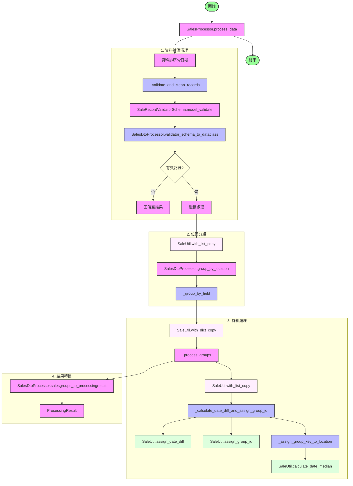

# SaleRecordProcessor 處理流程

## 類別職責說明

### SalesProcessor
主要的處理邏輯類別，負責協調整個處理流程。
- 資料預處理（排序）
- 資料驗證與清理
- 群組處理協調

### SalesDtoProcessor
資料轉換和分組處理的工具類別。主要負責：
- Schema 到 Dataclass 的轉換
- 記錄分組邏輯
- 結果轉換

### SaleUtil
通用工具類別，提供：
- 資料複製包裝（with_dict_copy, with_list_copy）
- 日期差異計算
- 群組 ID 分配
- 日期中位數計算

## 主要處理流程

1. **資料驗證與清理**
   - 資料預排序
   - 輸入驗證
   - Schema 轉換
   - 錯誤收集

2. **位置分組**
   - 資料複製保護
   - 依據位置進行初步分組
   - 使用通用分組函數

3. **群組處理**
   - 資料複製保護
   - 日期差異計算
   - 群組 ID 分配
   - 群組鍵生成

4. **結果轉換**
   - 轉換為最終的 ProcessingResult 格式
   - 包含分組資料和錯誤訊息